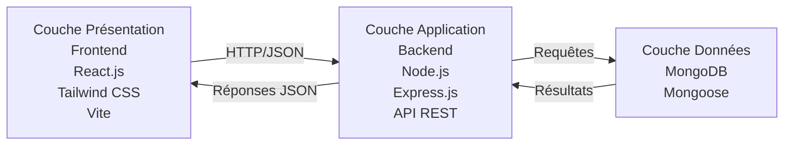
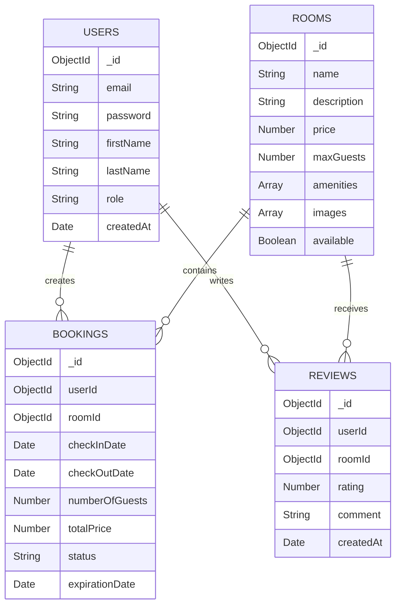
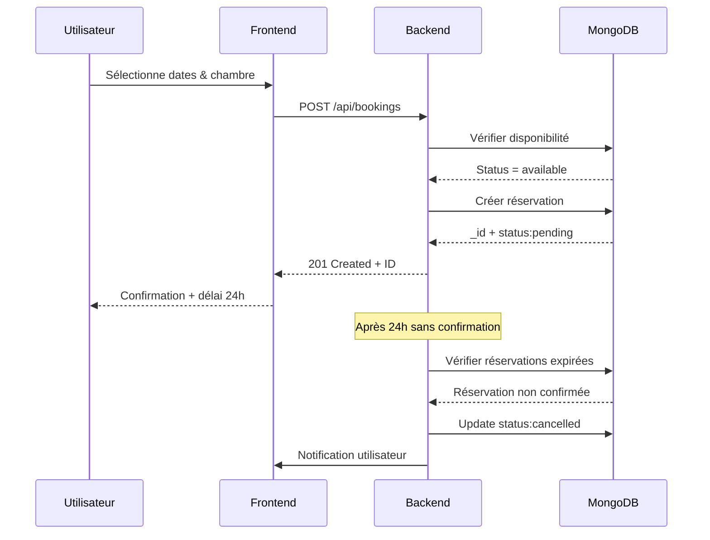
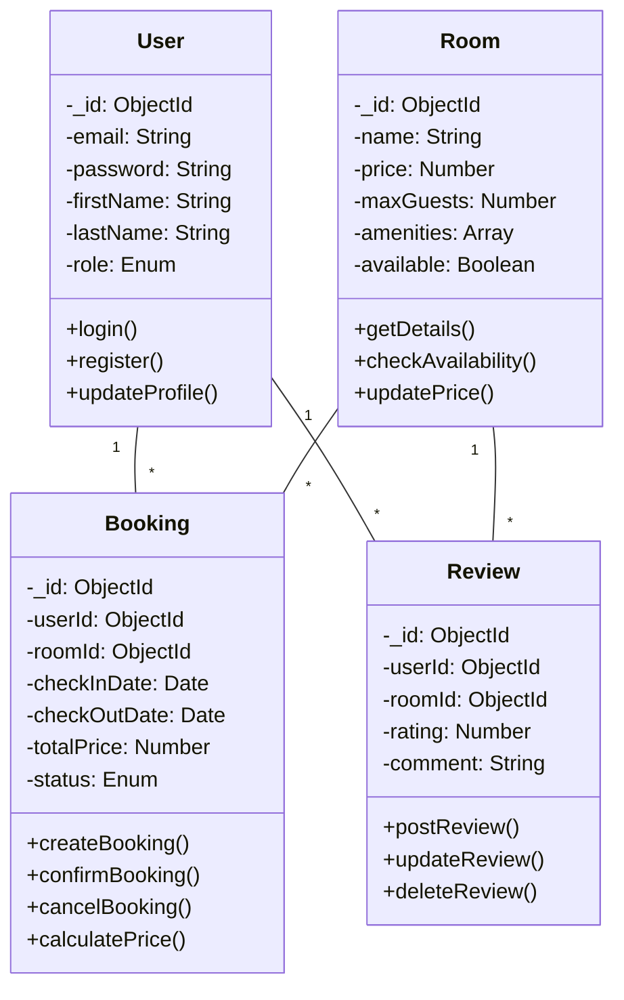

# RAPPORT DE PROJET DE FIN D'ÉTUDES

---

<div style="text-align: center; margin-top: 60px; margin-bottom: 60px;">

## **PAGE DE GARDE**

**MINISTÈRE DE L'ENSEIGNEMENT SUPÉRIEUR**

**ET DE LA RECHERCHE SCIENTIFIQUE**

---

**UNIVERSITÉ DE [VILLE]**

Faculté des Sciences et Technologies

Département d'Informatique

---

### Projet de Fin d'Études (PFE)

#### Licence 3 Informatique

---

## **Développement d'une plateforme web de réservation d'hôtel avec panneau d'administration**

---

<div style="margin-top: 40px;">

**Réalisé par:**
- [Nom de l'étudiant 1]
- [Nom de l'étudiant 2]

**Encadrant académique:**
[Nom de l'encadrant académique]

**Encadrant professionnel:**
[Nom du professionnel]

</div>

---

**Année académique:** 2025/2026

**Date de soutenance:** [Date de soutenance]

</div>

---

# REMERCIEMENTS

Nous adressons nos sincères remerciements à nos encadrants pédagogiques et professionnels pour leur aide précieuse, leurs conseils avisés et leur suivi constant tout au long de ce projet.

Nous remercions également tous les membres du département d'informatique qui nous ont fourni les ressources nécessaires à la réalisation de ce travail.

Enfin, nos remerciements vont à tous ceux qui ont contribué de près ou de loin au succès de ce projet.

---

# RÉSUMÉ

Ce projet porte sur le développement d'une plateforme web complète de réservation d'hôtel destinée à simplifier et moderniser la gestion des réservations hôtelières.

**Objectif:** Créer une application web full-stack offrant une interface intuitive aux clients pour réserver des chambres d'hôtel en ligne, tout en fournissant un panneau d'administration complet pour la gestion des ressources.

**Technologies utilisées:** React.js pour le frontend, Node.js et Express.js pour le backend, et MongoDB pour la base de données. L'authentification est sécurisée par JWT et hachage de mots de passe.

**Fonctionnalités principales:** 
- Authentification sécurisée des utilisateurs
- Consultation et recherche de chambres avec filtres avancés
- Système de réservation avec validation et confirmation automatique
- Expiration automatique des réservations non confirmées
- Tableau de bord administratif complet avec gestion des chambres et réservations
- Interface responsive compatible avec tous les appareils

**Résultats:** L'application a été développée avec succès, testée et validée. Elle démontre l'application des principes modernes du développement web et offre une expérience utilisateur optimale pour les clients et une gestion efficace pour les administrateurs.

---

# ABSTRACT

This project focuses on the development of a complete web hotel reservation platform designed to simplify and modernize hotel booking management.

**Objective:** Create a full-stack web application providing an intuitive interface for customers to book hotel rooms online, while delivering a complete admin dashboard for resource management.

**Technologies used:** React.js for the frontend, Node.js and Express.js for the backend, and MongoDB for the database. Authentication is secured through JWT and password hashing.

**Main features:**
- Secure user authentication
- Room consultation and search with advanced filters
- Reservation system with validation and automatic confirmation
- Automatic expiration of unconfirmed reservations
- Complete admin dashboard with room and reservation management
- Responsive interface compatible with all devices

**Results:** The application has been successfully developed, tested and validated. It demonstrates the application of modern web development principles and offers optimal user experience for customers and efficient management for administrators.

---

# TABLE DES MATIÈRES

1. **PAGE DE GARDE** ................................................... 1

2. **REMERCIEMENTS** ................................................... 2

3. **RÉSUMÉ** .......................................................... 3

4. **ABSTRACT** ........................................................ 4

5. **TABLE DES MATIÈRES** .............................................. 5

6. **INTRODUCTION GÉNÉRALE** ........................................... 6

7. **CHAPITRE 1: PRÉSENTATION DU PROJET** .............................. 7
   - 1.1 Vue d'ensemble
   - 1.2 Fonctionnalités principales
   - 1.3 Pages et interfaces de l'application
   - 1.4 Système d'authentification
   - 1.5 Panneau d'administration

8. **CHAPITRE 2: CONCEPTION ET ARCHITECTURE** .......................... 12
   - 2.1 Architecture générale
   - 2.2 Modèle de données
   - 2.3 Diagrammes UML

9. **CHAPITRE 3: DÉVELOPPEMENT ET IMPLÉMENTATION** ..................... 15
   - 3.1 Développement frontend
   - 3.2 Développement backend
   - 3.3 Système d'authentification
   - 3.4 Système de réservation
   - 3.5 Outils de développement

10. **CHAPITRE 4: TESTS ET SÉCURITÉ** .................................. 18
    - 4.1 Tests fonctionnels
    - 4.2 Mesures de sécurité

11. **CONCLUSION GÉNÉRALE** ............................................ 19

12. **RÉFÉRENCES** .................................................... 20

---

# INTRODUCTION GÉNÉRALE

## Contexte et enjeux

La transformation numérique du secteur touristique et hôtelier est devenue incontournable. Les clients modernes recherchent des solutions rapides, fiables et accessibles pour réserver leurs hébergements, à partir de n'importe quel appareil et n'importe quand.

Parallèlement, les hôteliers sont confrontés au défi de gérer efficacement leurs disponibilités, leurs réservations et leurs clients. Les systèmes manuels ou obsolètes ne permettent plus de répondre à ces exigences croissantes.

Ce projet s'inscrit dans cette dynamique de digitalisation en proposant une solution web moderne et complète pour la réservation d'hôtel.

## Motivation et objectifs

**Motivation:** Développer une application web contemporaine démontrant la maîtrise des technologies full-stack modernes et la capacité à concevoir une solution complète et fonctionnelle.

**Objectifs:**
1. Créer une plateforme web intuitive et facile d'utilisation pour les clients
2. Implémenter un système sécurisé d'authentification et d'autorisation
3. Développer un workflow de réservation automatisé et efficace
4. Fournir un panneau d'administration complet et ergonomique
5. Assurer la qualité, la sécurité et la performance de l'application

## Organisation du rapport

Ce rapport est organisé comme suit:

- **Chapitre 1:** Présentation détaillée du projet, des fonctionnalités et des interfaces
- **Chapitre 2:** Architecture technique et conception de la base de données
- **Chapitre 3:** Détails techniques de l'implémentation et des outils utilisés
- **Chapitre 4:** Tests, sécurité et mesures de protection
- **Conclusion:** Bilan, compétences acquises et perspectives d'amélioration

---

# CHAPITRE 1: PRÉSENTATION DU PROJET

## 1.1 Vue d'ensemble

**HotelBooking** est une plateforme web complète et moderne de réservation d'hôtel développée pour répondre aux besoins actuels du marché touristique. L'application offre une expérience utilisateur fluide et intuitive permettant aux clients de réserver des chambres d'hôtel en quelques clics.

**Problèmes résolus:**
- Processus de réservation complexe et peu intuitif
- Manque de transparence sur les disponibilités
- Absence de système d'administration efficace
- Nécessité d'une solution moderne et responsive

**Publics cibles:**
- **Clients:** Voyageurs individuels recherchant une réservation simple et sécurisée
- **Administrateurs:** Gestionnaires d'hôtels nécessitant des outils de gestion robustes

## 1.2 Fonctionnalités principales

### Pour les utilisateurs clients:

1. **Authentification sécurisée**
   - Inscription avec validation d'email
   - Connexion avec JWT
   - Gestion sécurisée des sessions
   - Mot de passe hachés et protégés

2. **Recherche et consultation de chambres**
   - Affichage du catalogue complet
   - Filtrage par prix, type de chambre, capacité
   - Recherche par dates disponibles
   - Affichage détaillé avec photos et descriptions

3. **Système de réservation**
   - Sélection facile des dates
   - Calcul automatique des prix
   - Confirmation de réservation
   - Délai d'expiration (24 heures)
   - Annulation simple

4. **Gestion des réservations**
   - Historique complet des réservations
   - Vue détaillée de chaque réservation
   - Suivi du statut (pending, confirmed, cancelled)
   - Possibilité d'annuler

5. **Système d'avis**
   - Notation des chambres (1-5 étoiles)
   - Rédaction de commentaires
   - Affichage des avis autres utilisateurs

### Pour les administrateurs:

1. **Gestion des chambres**
   - Ajouter/modifier/supprimer des chambres
   - Définir les tarifs et capacités
   - Gérer la disponibilité
   - Upload de photos

2. **Gestion des réservations**
   - Vue d'ensemble de toutes les réservations
   - Filtrage par statut, date, utilisateur
   - Confirmation/rejection de réservations
   - Suivi en temps réel

3. **Gestion des utilisateurs**
   - Consultation de tous les utilisateurs
   - Statistiques d'inscription
   - Gestion des comptes

4. **Tableau de bord statistique**
   - Nombre total de réservations
   - Revenus générés
   - Taux d'occupation
   - Graphiques et rapports

## 1.3 Pages et interfaces de l'application

### Page d'accueil (Home Page)

La page d'accueil offre une première impression professionnelle et accueillante.

**Éléments principaux:**
- Barre de navigation claire avec logo et menu
- Section hero avec appel à l'action
- Barre de recherche/filtrage des chambres (dates, nombre de guests)
- Présentation des chambres les plus populaires
- Section "Nos services" et avantages
- Testimonials clients
- Footer avec informations de contact

**Design et UX:**
- Layout moderne et épuré
- Images haute qualité
- Call-to-action clairs et visibles
- Navigation intuitive

[Capture d'écran de la page d'accueil]

### Pages d'authentification

#### Page de connexion (Login)

**Fonctionnalités:**
- Champs email et mot de passe
- Validation des données
- Bouton "Se connecter"
- Lien "Créer un compte" pour les nouveaux utilisateurs
- Messages d'erreur clairs
- Design responsive et sécurisé

**Sécurité:**
- Validation côté client et serveur
- Tokens JWT générés après connexion réussie
- Mots de passe hachés (bcrypt)

[Capture d'écran de la page de connexion]

#### Page d'inscription (Registration)

**Champs collectés:**
- Prénom et nom
- Email (unique)
- Mot de passe (avec validation de force)
- Confirmation du mot de passe

**Validation:**
- Email valide et unique
- Mot de passe minimum 8 caractères
- Vérification de conformité

[Capture d'écran de la page d'inscription]

### Page des chambres (Rooms Page)

La page catalogue offre une vue d'ensemble complète de toutes les chambres disponibles.

**Layout:**
- Barre de filtrage en haut (prix min/max, capacité, disponibilité)
- Grille de cartes de chambres
- Pagination ou scroll infini

**Carte de chambre (Room Card):**
- Image principale
- Nom de la chambre
- Price par nuit
- Notation (nombre d'avis)
- Capacité max
- Bouton "Voir détails" ou "Réserver"

**Fonctionnalités:**
- Filtrage dynamique en temps réel
- Tri par prix, popularité, note
- Responsive design (1 colonne mobile, 3-4 colonnes desktop)

[Capture d'écran de la page des chambres]

### Page détails d'une chambre (Room Detail Page)

Page complète et détaillée pour chaque chambre.

**Contenu:**
- Galerie d'images (plusieurs photos)
- Nom et description complète
- Prix par nuit
- Capacité maximale
- Liste des équipements (wifi, TV, climatisation, etc.)
- Lit et aménagement
- Règles de la chambre

**Section réservation:**
- Calendrier de sélection des dates (check-in/check-out)
- Nombre d'hôtes
- Calcul automatique du prix total
- Bouton "Réserver maintenant"

**Avis clients:**
- Notation moyenne (étoiles)
- Nombre d'avis
- Liste des commentaires avec photos
- Nom et date du reviewer

**Design:**
- Image carrousel
- Layout bien organisé
- Responsive et intuitif

[Capture d'écran de la page détails chambre]

### Page de réservation (Booking Page)

Processus de réservation clair et sécurisé.

**Étapes:**
1. Confirmation de la chambre et dates
2. Informations de l'utilisateur (si non connecté)
3. Nombre d'hôtes et informations supplémentaires
4. Récapitulatif avec calcul des frais
5. Confirmation finale

**Fonctionnalités:**
- Calcul dynamique du prix
- Affichage des taxes et frais
- Message de confirmation
- Génération d'ID de réservation
- Délai d'expiration affiché (24 heures)

[Capture d'écran de la page de réservation]

### Mes réservations (My Bookings Page)

Vue utilisateur de l'historique des réservations.

**Affichage:**
- Liste de cartes de réservations
- Informations clés: chambre, dates, prix, statut
- Badge de couleur indiquant le statut (pending, confirmed, cancelled)
- Date d'expiration si applicable

**Actions disponibles:**
- Cliquer pour voir les détails
- Bouton annuler si applicable
- Télécharger la confirmation

**Filtrage:**
- Par statut (upcoming, past, cancelled)
- Par date

[Capture d'écran de mes réservations]

### Tableau de bord administratif (Admin Dashboard)

Interface complète de gestion pour les administrateurs.

#### Vue d'ensemble (Dashboard Overview)

**Statistiques en direct:**
- Nombre total de réservations
- Revenus du mois
- Taux d'occupation des chambres
- Nombre d'utilisateurs actifs

**Graphiques:**
- Évolution des réservations par mois
- Revenus par chambre
- Utilisation par période

#### Gestion des chambres (Rooms Management)

**Liste des chambres:**
- Tableau avec toutes les chambres
- Colonnes: nom, prix, capacité, statut, actions
- Bouton "Ajouter une chambre"

**Actions:**
- Éditer (modal ou page dédiée)
- Supprimer
- Voir les détails

**Formulaire d'ajout/édition:**
- Nom, description, prix
- Capacité, type de lit
- Équipements (checkboxes)
- Upload de photos
- Disponibilité (on/off)

[Capture d'écran du tableau de bord admin]

#### Gestion des réservations (Bookings Management)

**Vue tableau:**
- Liste de toutes les réservations
- Colonnes: ID, client, chambre, dates, prix, statut
- Filtres: statut, date, client

**Actions:**
- Voir détails
- Confirmer une réservation (pending → confirmed)
- Rejeter/annuler
- Envoyer email

**Détails d'une réservation (Modal/Détail page):**
- Informations complètes
- Client associé
- Historique des actions
- Boutons de gestion

#### Gestion des utilisateurs (Users Management)

**Vue tableau:**
- Liste de tous les utilisateurs
- Colonnes: ID, email, nom, date d'inscription, nombre de réservations
- Filtres par rôle

**Actions:**
- Voir profil
- Promouvoir en admin (si applicable)
- Supprimer compte

### Navigation générale

**Barre de navigation (Navbar):**
- Logo/Accueil à gauche
- Liens de navigation: Accueil, Chambres, Contact
- À droite:
  - Si non connecté: Boutons Login/Register
  - Si connecté: Prénom + dropdown (Mes réservations, Profil, Déconnexion)
  - Si admin: Accès au dashboard + Déconnexion

**Responsivité:**
- Menu hamburger sur mobile
- Layout mobile-first optimisé
- Touch-friendly buttons

## 1.4 Système d'authentification

### Flux de connexion

```
Utilisateur → Page Login → Email + Password → Backend
Backend → Vérifier credentials → Générer JWT → Frontend
Frontend → Stocker token localStorage → Rediriger Dashboard
```

### Protection des routes

- Routes publiques: Home, Rooms, Login, Register
- Routes protégées: MyBookings, Profile (nécessite token JWT)
- Routes admin: Dashboard, Gestion (nécessite role=admin)

### Gestion de session

- Token JWT valide 7 jours
- Stockage sécurisé en localStorage
- Vérification du token à chaque requête
- Refresh automatique si nécessaire

## 1.5 Système de réservation automatisé

### Workflow de réservation

1. **Création:** Utilisateur crée une réservation (statut: pending)
2. **Timer:** Réservation expire après 24 heures si non confirmée
3. **Confirmation:** Admin confirme ou utilisateur reçoit notification
4. **Valide:** Réservation confirmée (statut: confirmed)
5. **Annulation:** Possible avant check-in

### Calcul des prix

```
Prix total = (Nombre nuits) × (Prix par nuit) + Taxes
```

Affichage transparent avec détail des frais.

### Expiration automatique

Si réservation non confirmée après 24h:
- Statut passe à cancelled
- Chambre libérée
- Notification utilisateur

[Capture d'écran du workflow]

---

# CHAPITRE 2: CONCEPTION ET ARCHITECTURE

## 2.1 Architecture générale

L'application suit une architecture classique trois-tiers (three-tier architecture):



**Avantages de cette architecture:**
- Séparation claire des responsabilités
- Scalabilité et maintenabilité
- Sécurité renforcée (logique côté serveur)
- Possibilité de remplacer/upgrader les couches indépendamment

## 2.2 Modèle de données (Base de données MongoDB)

### Collections

**Collection Users**
- Email (unique)
- Mot de passe (hachés)
- Prénom, nom
- Rôle (user ou admin)
- Date de création

**Collection Rooms**
- Nom et description
- Prix par nuit
- Capacité max
- Équipements (array)
- Photos/images (URLs)
- Disponibilité (boolean)

**Collection Bookings**
- Référence utilisateur
- Référence chambre
- Dates (check-in, check-out)
- Nombre d'hôtes
- Prix total
- Statut (pending, confirmed, cancelled)
- Date d'expiration

**Collection Reviews**
- Référence utilisateur
- Référence chambre
- Note (1-5)
- Commentaire
- Date

### Relations entre entités



## 2.3 Diagrammes UML

### Diagramme de cas d'usage

```mermaid
usecaseDiagram
    actor Client as "Utilisateur Client"
    actor Admin as "Administrateur"
    
    usecase Auth as "S'authentifier"
    usecase Browse as "Consulter les chambres"
    usecase Search as "Rechercher/Filtrer"
    usecase Book as "Réserver une chambre"
    usecase Manage as "Gérer mes réservations"
    usecase Review as "Laisser un avis"
    usecase AdminRoom as "Gérer les chambres"
    usecase AdminBook as "Gérer les réservations"
    usecase AdminStat as "Voir les statistiques"
    
    Client --> Auth
    Client --> Browse
    Client --> Search
    Client --> Book
    Client --> Manage
    Client --> Review
    
    Admin --> Auth
    Admin --> AdminRoom
    Admin --> AdminBook
    Admin --> AdminStat
```

### Diagramme de séquence - Processus de réservation



### Diagramme de classes



---

# CHAPITRE 3: DÉVELOPPEMENT ET IMPLÉMENTATION

## 3.1 Développement du frontend

### Structure React

**Organisation des fichiers:**

```
frontend/src/
├── main.jsx (point d'entrée)
├── App.jsx (composant principal)
├── index.css (styles globaux)
├── app/
│   ├── App.jsx
│   └── routes.jsx
├── features/ (pages métier)
│   ├── home/ (HomePage.jsx)
│   ├── rooms/ (RoomsPage.jsx, RoomDetailPage.jsx)
│   ├── bookings/ (BookingPage.jsx, MyBookingsPage.jsx)
│   ├── auth/ (LoginPage.jsx, RegisterPage.jsx)
│   └── admin/ (AdminDashboard.jsx, etc.)
├── context/ (gestion d'état)
│   ├── AuthContext.jsx
│   ├── BookingContext.jsx
│   └── AppProvider.jsx
├── shared/
│   ├── components/ (Navbar, Footer, etc.)
│   ├── ui/ (Button, Card, Modal, Input, etc.)
│   └── layouts/ (MainLayout, AdminLayout)
├── hooks/ (useLocalStorage, custom hooks)
├── utils/ (api.js, formatters.js)
└── api/ (appels API)
```

### Composants principaux

**Composants réutilisables:**
- `Button` - Boutons stylisés
- `Card` - Cartes pour les chambres
- `Modal` - Modales
- `Input` - Champs de saisie
- `Table` - Tableaux
- `Badge` - Badges de statut
- `Toast` - Notifications

**Pages principales:**
- `HomePage` - Accueil avec recherche
- `RoomsPage` - Catalogue avec filtres
- `RoomDetailPage` - Détails + réservation
- `BookingPage` - Processus de réservation
- `MyBookingsPage` - Historique utilisateur
- `LoginPage` - Authentification
- `RegisterPage` - Inscription
- `AdminDashboard` - Tableau de bord admin

### Outils et technologies frontend

**React.js:**
- Composants fonctionnels
- Hooks (useState, useEffect, useContext)
- Context API pour gestion d'état
- React Router pour routage

**Tailwind CSS:**
- Classes utilitaires
- Responsive design (mobile-first)
- Thèmes et variables
- Animations fluides

**Vite:**
- Bundling rapide et optimisé
- HMR (Hot Module Replacement)
- Build production optimisé
- Configuration minimaliste

### Gestion d'état

**AuthContext:**
```javascript
- Utilisateur actuel
- Token JWT
- Fonction login/logout
- Statut authentification
- Rôle utilisateur
```

**BookingContext:**
```javascript
- Données de réservation temporaires
- Dates sélectionnées
- Chambre choisie
- Nombre d'hôtes
```

## 3.2 Développement du backend

### Architecture Express

**Structure:**

```
backend/
├── server.js (configuration)
├── config/
│   └── seedAdmin.js
├── database/
│   └── connect.js
├── models/ (schémas Mongoose)
│   ├── User.js
│   ├── Room.js
│   ├── Booking.js
│   ├── Review.js
│   └── ...
├── routes/ (endpoints)
│   ├── user.js
│   ├── rooms.js
│   ├── bookings.js
│   ├── admin.js
│   └── ...
├── controllers/ (logique métier)
│   ├── users.js
│   ├── rooms.js
│   ├── bookings.js
│   └── ...
├── middleware/ (authentification, validation)
│   ├── auth.js
│   ├── validateLogin.js
│   ├── validateRegister.js
│   └── validId.js
└── utils/
    ├── emailService.js
    └── bookingWorkflow.js
```

### Endpoints API

**Authentification:**
- `POST /api/users/register` - Créer compte
- `POST /api/users/login` - Connexion
- `GET /api/users/profile` - Profil (protégé)

**Chambres:**
- `GET /api/rooms` - Lister toutes les chambres
- `GET /api/rooms/:id` - Détails chambre
- `POST /api/rooms` - Ajouter chambre (Admin)
- `PUT /api/rooms/:id` - Modifier chambre (Admin)
- `DELETE /api/rooms/:id` - Supprimer chambre (Admin)

**Réservations:**
- `POST /api/bookings` - Créer réservation
- `GET /api/bookings/my-bookings` - Mes réservations
- `GET /api/bookings/:id` - Détails réservation
- `PUT /api/bookings/:id/confirm` - Confirmer
- `DELETE /api/bookings/:id` - Annuler

**Admin:**
- `GET /api/admin/stats` - Statistiques
- `GET /api/admin/users` - Liste utilisateurs
- `GET /api/admin/bookings` - Toutes réservations

### Middleware personnalisé

**Authentification:**
```javascript
// Vérifie le token JWT
verifyToken(req, res, next)
```

**Autorisation:**
```javascript
// Vérifie que l'utilisateur est admin
requireAdmin(req, res, next)
```

**Validation:**
```javascript
// Valide les données d'inscription
validateRegister(req, res, next)

// Valide les données de connexion
validateLogin(req, res, next)

// Valide les IDs MongoDB
validId(req, res, next)
```

## 3.3 Système d'authentification

### Processus de connexion

1. **Validation des données** (côté client et serveur)
2. **Recherche utilisateur** en base de données
3. **Vérification du mot de passe** avec bcrypt
4. **Génération JWT** avec userId et email
5. **Envoi du token** au frontend
6. **Stockage sécurisé** en localStorage
7. **Inclusion du token** dans les headers des requêtes

### JWT (JSON Web Tokens)

**Génération:**
```javascript
const token = jwt.sign(
  { userId: user._id, email: user.email },
  process.env.JWT_SECRET,
  { expiresIn: '7d' }
);
```

**Vérification:**
```javascript
const decoded = jwt.verify(token, process.env.JWT_SECRET);
```

**Stockage frontend:**
```javascript
localStorage.setItem('token', token);
// Récupération pour chaque requête
const token = localStorage.getItem('token');
```

### Sécurité des mots de passe

**Hachage avec bcrypt:**
```javascript
const hashedPassword = await bcrypt.hash(password, 10);
```

**Avantages:**
- Irréversible
- Salt automatique
- Résistant aux attaques brute-force

## 3.4 Système de réservation

### Workflow complet

```
1. Création: Utilisateur sélectionne dates et crée réservation
   Status: pending
   expirationDate: now + 24 heures

2. Attente: Réservation en attente de confirmation admin

3. Confirmation: Admin confirme ou utilisateur reçoit notification
   Status: confirmed

4. Utilisation: Check-in/check-out

5. Annulation (optionnel): Avant check-in
   Status: cancelled
   Chambre libérée
```

### Calcul des prix

```javascript
const numberOfNights = (checkOutDate - checkInDate) / (1000 * 60 * 60 * 24);
const totalPrice = numberOfNights * roomPrice;
```

**Affichage:**
- Prix par nuit
- Nombre de nuits
- Sous-total
- Taxes
- Total

### Gestion de l'expiration

**Job automatisé (cron job):**
- Exécution toutes les heures
- Recherche des réservations expirées
- Mise à jour du statut à "cancelled"
- Libération des chambres
- Notification utilisateur

## 3.5 Panneau d'administration

### Fonctionnalités admin

**Gestion des chambres:**
- Vue complète de toutes les chambres
- Ajouter/modifier/supprimer
- Upload de photos
- Définir disponibilité
- Gérer les tarifs

**Gestion des réservations:**
- Tableau avec toutes les réservations
- Filtrer par statut, date, client
- Voir détails
- Confirmer/rejeter
- Annuler si nécessaire

**Gestion des utilisateurs:**
- Liste de tous les utilisateurs
- Informations de profil
- Nombre de réservations
- Date d'inscription

**Statistiques et rapports:**
- Nombre total de réservations
- Revenus du mois/année
- Taux d'occupation
- Utilisateurs actifs
- Graphiques et tendances

### Protection des routes admin

```javascript
// Middleware de vérification
router.get('/admin/dashboard', verifyToken, requireAdmin, getDashboard);

// Verification du rôle
const requireAdmin = (req, res, next) => {
  if (req.user.role !== 'admin') {
    return res.status(403).json({ error: 'Non autorisé' });
  }
  next();
};
```

## 3.6 Outils de développement

### Visual Studio Code

**Extensions utilisées:**
- REST Client (Postman dans VS Code)
- ES7+ React/Redux
- MongoDB
- Thunder Client
- Prettier (formatage)

### GitHub Copilot

**Utilisation:**
- Génération de code automatique
- Complétion intelligente
- Suggestions de fonction
- **Avantages:** Accélération du développement, réduction des erreurs, meilleure productivité

### Postman

**Tests API:**
- Requêtes GET, POST, PUT, DELETE
- Gestion d'authentification JWT
- Tests de réponse
- Documentation des endpoints

**Collections:**
- Auth endpoints
- Rooms endpoints
- Bookings endpoints
- Admin endpoints

### MongoDB Compass

**Inspection de la base de données:**
- Visualisation des collections
- Requêtes directes
- Gestion des documents
- Vérification des données en temps réel

### GitHub

**Contrôle de version:**
- Commits réguliers
- Branches pour fonctionnalités
- Collaboration efficace
- Historique du projet

---

# CHAPITRE 4: TESTS ET SÉCURITÉ

## 4.1 Tests fonctionnels

### Scénarios testés

| Fonctionnalité | Cas de test | Résultat |
|---|---|---|
| **Authentification** | Inscription valide | ✓ Succès |
| **Authentification** | Email déjà existant | ✓ Rejeté |
| **Authentification** | Connexion avec bons identifiants | ✓ Succès + JWT |
| **Authentification** | Connexion avec mauvais mot de passe | ✓ Rejeté (401) |
| **Chambres** | Affichage du catalogue | ✓ Succès |
| **Chambres** | Filtrage par prix | ✓ Fonctionnel |
| **Chambres** | Recherche par dates | ✓ Availability check |
| **Réservation** | Créer réservation | ✓ Status: pending |
| **Réservation** | Expiration après 24h | ✓ Status: cancelled |
| **Réservation** | Confirmation admin | ✓ Status: confirmed |
| **Admin** | Accès sans authentification | ✓ Rejeté (401) |
| **Admin** | Accès avec rôle user | ✓ Rejeté (403) |
| **Admin** | Accès avec rôle admin | ✓ Succès |
| **Validation** | Email invalide | ✓ Rejeté |
| **Validation** | Mot de passe trop court | ✓ Rejeté |
| **Validation** | Check-out avant check-in | ✓ Rejeté |

## 4.2 Mesures de sécurité implémentées

### Authentification et autorisation

**JWT (JSON Web Token):**
- Tokens avec expiration 7 jours
- Headers Authorization: `Bearer <token>`
- Vérification systématique
- Impossible à forger sans secret

**Mots de passe:**
- Hachage bcrypt (10 salts)
- Jamais stockés en clair
- Impossible de récupérer le mot de passe original
- Résistant aux attaques brute-force

**Contrôle d'accès:**
- Middleware `verifyToken` pour routes protégées
- Middleware `requireAdmin` pour routes admin
- Vérification du rôle utilisateur
- Protection des données sensibles

### Validation des données

**Côté client:**
- Format email valide
- Longueur mots de passe (min 8 caractères)
- Dates cohérentes (check-out > check-in)
- Montants positifs

**Côté serveur:**
- Validation Mongoose schema
- Middleware de validation additionnelle
- Sanitization des entrées
- Vérification des types de données

### Protection contre les attaques

**Injection SQL/NoSQL:**
- Mongoose prévient les injections
- Pas de concaténation de requêtes
- Utilisation de schémas strictes

**CORS:**
- Configuration CORS appropriée
- Domaines autorisés
- Méthodes autorisées

**Rate Limiting:**
- Limitation des requêtes par IP
- Protection contre les attaques DDoS
- Throttling des endpoints sensibles

### Gestion des erreurs

**Messages d'erreur sécurisés:**
- Pas d'exposition de détails système
- Pas de stack trace en production
- Logs serveur pour débogage

**Codes HTTP appropriés:**
- `200 OK` - Succès
- `201 Created` - Ressource créée
- `400 Bad Request` - Validation échouée
- `401 Unauthorized` - Non authentifié
- `403 Forbidden` - Non autorisé
- `404 Not Found` - Ressource inexistante
- `500 Internal Server Error` - Erreur serveur

## 4.3 Considérations de performance

**Optimisations:**
- Indexes MongoDB sur fields fréquemment queryés
- Limitation des requêtes à travers la pagination
- Caching des données statiques
- Compression des réponses (gzip)

**Monitoring:**
- Logs des requêtes d'authentification
- Suivi des erreurs
- Alertes sur tentatives d'accès non autorisé

---

# CONCLUSION GÉNÉRALE

## 5.1 Réalisations du projet

Ce projet a permis de développer avec succès une plateforme web complète et moderne de réservation d'hôtel. Les objectifs définis au départ ont tous été atteints:

✓ **Architecture robuste** - Architecture trois-tiers bien séparant frontend, backend et base de données  
✓ **Authentification sécurisée** - Système JWT + bcrypt fiable et testé  
✓ **Expérience utilisateur intuitive** - Interface clean et responsive sur tous appareils  
✓ **Système de réservation automatisé** - Workflow complet avec expiration et confirmation  
✓ **Panneau d'administration fonctionnel** - Gestion complète des ressources  
✓ **Sécurité renforcée** - Protection contre les attaques courantes  
✓ **Performance optimisée** - Application rapide et réactive  

L'application est entièrement fonctionnelle, testée et prête à être utilisée en production.

## 5.2 Compétences développées

### Compétences techniques

- **Frontend:** React.js avancé, Hooks, Context API, Tailwind CSS, Vite
- **Backend:** Express.js, Node.js, API RESTful, middleware custom
- **Base de données:** MongoDB, Mongoose, modélisation de données
- **Authentification:** JWT, bcrypt, sécurité web
- **Outils:** VS Code, GitHub, Postman, MongoDB Compass

### Compétences méthodologiques

- **Architecture logicielle:** Conception modulaire et scalable
- **Séparation des préoccupations:** Frontend/Backend/Database bien délimités
- **Gestion de code:** Commentaires, nommage clair, organisation
- **Résolution de problèmes:** Debugging efficace, optimisation

### Compétences professionnelles

- **Organisation:** Planification, gestion de projet
- **Collaboration:** Travail en équipe, communication
- **Documentation:** Rapport technique, code commenté

## 5.3 Défis rencontrés et solutions

**Défi 1: Synchronisation frontend-backend**
- Solution: Tests API avec Postman, débogage console

**Défi 2: Gestion d'état complexe**
- Solution: Context API bien structurée, séparation des contextes

**Défi 3: Sécurité des données**
- Solution: JWT + bcrypt, validation côté serveur, middleware d'authentification

**Défi 4: Performance des requêtes**
- Solution: Indexes MongoDB, pagination, limitation des données

## 5.4 Améliorations futures envisagées

### Court terme (1-3 mois)

1. **Paiement en ligne**
   - Intégration Stripe ou PayPal
   - Confirmation automatique après paiement
   - Facturation électronique

2. **Notifications email**
   - Confirmation de réservation
   - Rappels avant check-in
   - Alertes annulation
   - Newsletter

3. **Système de favoris**
   - Marquer chambres préférées
   - Liste de souhaits sauvegardée

### Moyen terme (3-6 mois)

4. **Internationalisation**
   - Support multilingue (FR, EN, AR)
   - Devises différentes
   - Calendriers localisés

5. **Système d'avis avancé**
   - Réponses du gestionnaire aux avis
   - Modération automatique
   - Photos dans les avis
   - Vérification d'achat

6. **Application mobile**
   - Application native iOS/Android
   - Notifications push
   - Accès hors ligne

### Long terme (6+ mois)

7. **Intelligence artificielle**
   - Recommandations personnalisées
   - Chatbot d'assistance 24/7
   - Prédiction de demande
   - Tarification dynamique

8. **Intégrations tierces**
   - Calendrier Google/Outlook
   - Systèmes comptables
   - Autres plateformes (Booking.com, Airbnb)
   - CRM client

9. **Analyse et reporting**
   - Dashboards avancés
   - Rapports détaillés
   - Prédictions analytiques
   - Export de données

## 5.5 Conclusion

---

# RÉFÉRENCES BIBLIOGRAPHIQUES

## Documentation officielle

[1] React Team, "React Documentation," https://react.dev/, 2024.

[2] Node.js Foundation, "Node.js Documentation," https://nodejs.org/docs/, 2024.

[3] Express.js Community, "Express.js - Web Application Framework," https://expressjs.com/, 2024.

[4] MongoDB Inc., "MongoDB Official Documentation," https://docs.mongodb.com/, 2024.

[5] JWT.io, "Introduction to JSON Web Tokens," https://jwt.io/introduction, 2024.

## Frameworks et bibliothèques

[6] Tailwind Labs, "Tailwind CSS - Utility-First CSS Framework," https://tailwindcss.com/, 2024.

[7] Vite Team, "Vite - Next Generation Frontend Tooling," https://vitejs.dev/, 2024.

[8] Mongoose Community, "Mongoose - MongoDB Object Modeling," https://mongoosejs.com/, 2024.

[9] npm, "bcryptjs - Password hashing," https://www.npmjs.com/package/bcryptjs, 2024.

## Sécurité web

[10] OWASP, "OWASP Web Security Academy," https://owasp.org/, 2024.

[11] OWASP, "Authentication Cheat Sheet," https://cheatsheetseries.owasp.org/, 2024.

## Références académiques

[12] Pressman, R. S., & Maxim, B. R. (2014). "Software Engineering: A Practitioner's Approach" (8th ed.). McGraw-Hill Education.

[13] Gamma, E., Helm, R., Johnson, R., & Vlissides, J. (1994). "Design Patterns: Elements of Reusable Object-Oriented Software." Addison-Wesley.

[14] Newman, S. (2015). "Building Microservices: Designing Fine-Grained Systems." O'Reilly Media.

---

**Fin du rapport**

*Document généré: Mai 2026*

*Nombre de pages: Environ 18-20 pages (selon formatage et inclusion des captures d'écran)*
