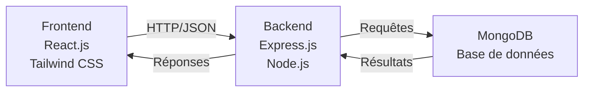
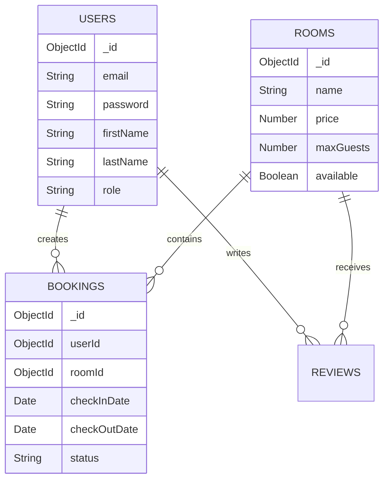
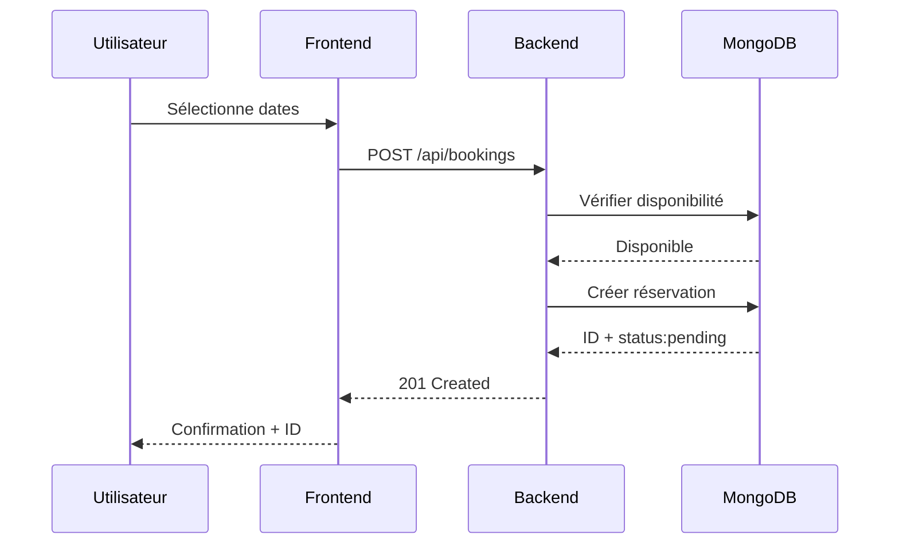
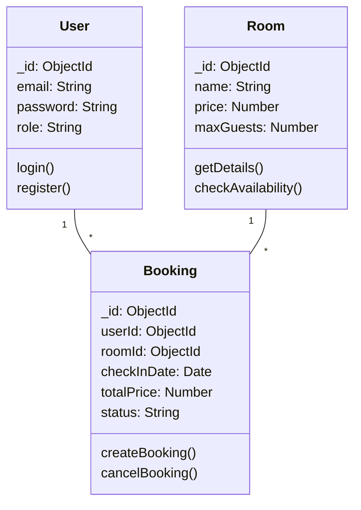

# RAPPORT DE PROJET DE FIN D'ÉTUDES

## Développement d'une plateforme web de réservation d'hôtel avec panneau d'administration

---

# PAGE DE GARDE

**MINISTÈRE DE L'ENSEIGNEMENT SUPÉRIEUR ET DE LA RECHERCHE SCIENTIFIQUE**

**UNIVERSITÉ DE [VILLE]**

**Faculté des Sciences et Technologies**

**Département d'Informatique**

---

**Projet de Fin d'Études (PFE)**

**Licence 3 Informatique**

---

### Développement d'une plateforme web de réservation d'hôtel avec panneau d'administration

---

**Réalisé par:**

- [Nom de l'étudiant 1]
- [Nom de l'étudiant 2]

---

**Encadrant académique:** [Nom]

**Encadrant professionnel:** [Nom]

---

**Année académique:** 2025/2026

**Date de soutenance:** [Date]

---

# REMERCIEMENTS

Nous adressons nos sincères remerciements à nos encadrants académiques et professionnels pour leur aide précieuse, leurs conseils avisés et leur suivi constant tout au long de ce projet.

Nous remercions également tous les membres du département d'informatique qui nous ont fourni les ressources nécessaires à la réalisation de ce travail.

Enfin, nos remerciements vont à tous ceux qui ont contribué de près ou de loin au succès de ce projet.

---

# RÉSUMÉ

Ce projet porte sur le développement d'une plateforme web complète de réservation d'hôtel destinée à simplifier et moderniser la gestion des réservations hôtelières.

**Objectif principal:** Créer une application web full-stack offrant une interface intuitive aux clients pour réserver des chambres d'hôtel en ligne, tout en fournissant un panneau d'administration complet pour la gestion des ressources.

**Technologies utilisées:** React.js pour le frontend, Node.js et Express.js pour le backend, et MongoDB pour la base de données. L'authentification est sécurisée par JWT et hachage de mots de passe.

**Fonctionnalités principales:**
- Authentification sécurisée des utilisateurs
- Recherche et consultation de chambres avec filtres
- Système de réservation automatisé
- Gestion des annulations avec expiration
- Tableau de bord administratif complet
- Interface responsive sur tous appareils

**Résultats:** L'application a été développée avec succès, testée et validée. Elle démontre l'application des principes modernes du développement web et offre une expérience utilisateur optimale.

---

# ABSTRACT

This project focuses on the development of a complete web hotel reservation platform designed to simplify and modernize hotel booking management.

**Main Objective:** Create a full-stack web application providing an intuitive interface for customers to book hotel rooms online, while delivering a complete admin dashboard for resource management.

**Technologies Used:** React.js for the frontend, Node.js and Express.js for the backend, and MongoDB for the database. Authentication is secured through JWT and password hashing.

**Main Features:**
- Secure user authentication
- Room search and consultation with filters
- Automated reservation system
- Cancellation management with expiration
- Complete administrative dashboard
- Responsive interface on all devices

**Results:** The application has been successfully developed, tested and validated. It demonstrates the application of modern web development principles and provides optimal user experience.

---

# TABLE DES MATIÈRES

1. PAGE DE GARDE ..................................... 1
2. REMERCIEMENTS ..................................... 2
3. RÉSUMÉ ............................................ 3
4. ABSTRACT .......................................... 4
5. TABLE DES MATIÈRES ................................ 5
6. INTRODUCTION GÉNÉRALE ............................. 6
7. CHAPITRE 1: PRÉSENTATION DU SITE WEB ............ 7
   - 1.1 Vue d'ensemble
   - 1.2 Fonctionnalités principales
   - 1.3 Pages et interfaces
8. CHAPITRE 2: CONCEPTION ET ARCHITECTURE ......... 11
   - 2.1 Architecture générale
   - 2.2 Modèle de données
   - 2.3 Diagrammes UML
9. CHAPITRE 3: DÉVELOPPEMENT ET IMPLÉMENTATION ... 14
   - 3.1 Frontend
   - 3.2 Backend
   - 3.3 Authentification
   - 3.4 Système de réservation
   - 3.5 Outils utilisés
10. CHAPITRE 4: TESTS ET SÉCURITÉ ................. 17
11. CONCLUSION GÉNÉRALE ........................... 18
12. RÉFÉRENCES ..................................... 20

---

# INTRODUCTION GÉNÉRALE

## Contexte et justification

La transformation numérique du secteur touristique et hôtelier s'est accélérée ces dernières années. Les clients modernes recherchent des solutions rapides, fiables et accessibles pour réserver leurs hébergements à partir de n'importe quel appareil et n'importe quand.

Parallèlement, les hôteliers font face au défi de gérer efficacement leurs disponibilités, réservations et clients. Les systèmes manuels ou obsolètes ne permettent plus de répondre à ces exigences croissantes.

Ce projet s'inscrit dans cette dynamique de digitalisation en proposant une solution web moderne et complète pour la réservation d'hôtel.

## Objectifs du projet

Les principaux objectifs sont:

1. Développer une plateforme web intuitive et facile à utiliser
2. Implémenter un système d'authentification sécurisé et robuste
3. Créer un workflow de réservation automatisé et fiable
4. Fournir des outils d'administration complets et ergonomiques
5. Assurer la qualité, la sécurité et la performance

## Organisation du rapport

Ce rapport est structuré comme suit:

- **Chapitre 1:** Présentation du site web et de ses fonctionnalités
- **Chapitre 2:** Conception architecturale et modélisation des données
- **Chapitre 3:** Détails techniques de l'implémentation
- **Chapitre 4:** Tests, sécurité et mesures de protection
- **Conclusion:** Bilan, compétences acquises et perspectives

---

# CHAPITRE 1: PRÉSENTATION DU SITE WEB

## 1.1 Vue d'ensemble

**HotelBooking** est une plateforme web moderne de réservation d'hôtel développée pour répondre aux besoins actuels du marché touristique. L'application offre une expérience utilisateur fluide et intuitive permettant aux clients de réserver des chambres d'hôtel en quelques clics.

### Problèmes résolus

- Processus de réservation complexe et peu intuitif
- Manque de transparence sur les disponibilités
- Absence de système d'administration efficace
- Nécessité d'une solution moderne et responsive

### Publics cibles

- **Clients:** Voyageurs individuels recherchant une réservation simple et sécurisée
- **Administrateurs:** Gestionnaires d'hôtels nécessitant des outils de gestion robustes

## 1.2 Fonctionnalités principales

### Pour les utilisateurs clients

1. **Authentification sécurisée**
   - Inscription avec validation d'email
   - Connexion avec JWT
   - Gestion sécurisée des sessions
   - Mots de passe hachés avec bcrypt

2. **Recherche et consultation de chambres**
   - Affichage du catalogue complet
   - Filtrage par prix, type, capacité
   - Recherche par disponibilité
   - Détails avec photos et descriptions

3. **Système de réservation**
   - Sélection des dates
   - Calcul automatique des prix
   - Confirmation de réservation
   - Délai d'expiration (24 heures)

4. **Gestion des réservations**
   - Historique complet
   - Suivi du statut (pending, confirmed, cancelled)
   - Possibilité d'annuler
   - Détails détaillés

5. **Système d'avis**
   - Notation 1-5 étoiles
   - Rédaction de commentaires
   - Affichage des avis autres clients

### Pour les administrateurs

1. **Gestion des chambres**
   - Ajouter/modifier/supprimer des chambres
   - Définir tarifs et capacités
   - Gérer la disponibilité
   - Upload de photos

2. **Gestion des réservations**
   - Vue d'ensemble complète
   - Filtrage par statut, date, client
   - Confirmation/rejection
   - Suivi en temps réel

3. **Gestion des utilisateurs**
   - Liste de tous les utilisateurs
   - Statistiques d'inscription
   - Gestion des comptes

4. **Tableau de bord statistique**
   - Nombre de réservations
   - Revenus générés
   - Taux d'occupation
   - Graphiques et rapports

## 1.3 Pages et interfaces de l'application

### Page d'accueil

La page d'accueil offre une première impression professionnelle et accueillante.

**Éléments clés:**
- Barre de navigation claire avec logo et menu
- Section hero avec appel à l'action
- Barre de recherche rapide (dates, nombre d'hôtes)
- Chambres populaires en vedette
- Section services et avantages
- Témoignages clients
- Footer avec informations

**Design:** Layout moderne épuré, images haute qualité, navigation intuitive.


### Pages d'authentification

#### Login
- Champs email et mot de passe
- Validation des données
- Messages d'erreur clairs
- Lien vers inscription

#### Inscription
- Collecte: prénom, nom, email, mot de passe
- Validation: email unique, mot de passe fort
- Confirmation d'email


### Page des chambres

La page catalogue offre une vue complète de toutes les chambres.

**Fonctionnalités:**
- Barre de filtrage (prix, capacité, disponibilité)
- Grille de cartes de chambres
- Pagination
- Tri par prix, popularité, note

**Carte de chambre:**
- Image principale
- Nom et prix par nuit
- Note (étoiles)
- Capacité
- Bouton "Voir détails" / "Réserver"


### Page détails chambre

Page complète pour chaque chambre.

**Contenu:**
- Galerie d'images
- Description complète
- Prix et capacité
- Liste des équipements
- Avis clients

**Section réservation:**
- Calendrier (check-in/check-out)
- Nombre d'hôtes
- Calcul automatique du prix
- Bouton "Réserver maintenant"


### Page de réservation

Processus de réservation clair et sécurisé.

**Étapes:**
1. Confirmation chambre et dates
2. Informations utilisateur (si non connecté)
3. Nombre d'hôtes
4. Récapitulatif avec frais
5. Confirmation finale

**Fonctionnalités:**
- Calcul dynamique du prix
- Affichage taxes et frais
- Message de confirmation
- ID de réservation
- Délai d'expiration (24h)


### Mes réservations

Vue utilisateur de l'historique des réservations.

**Affichage:**
- Liste de cartes de réservations
- Informations clés: chambre, dates, prix, statut
- Badge de statut (pending, confirmed, cancelled)
- Date d'expiration si applicable

**Actions:**
- Voir détails
- Annuler si applicable
- Télécharger confirmation


### Tableau de bord administratif

Interface complète de gestion pour administrateurs.

**Sections:**
- **Statistiques:** Nombre réservations, revenus, taux d'occupation
- **Gestion chambres:** CRUD complet, tableau avec actions
- **Gestion réservations:** Liste avec filtres, actions de confirmation
- **Gestion utilisateurs:** Vue d'ensemble, statistiques

**Graphiques:**
- Évolution réservations par mois
- Revenus par chambre
- Taux occupation


---

# CHAPITRE 2: CONCEPTION ET ARCHITECTURE

## 2.1 Architecture générale

L'application suit une architecture classique trois-tiers:



**Avantages:**
- Séparation claire des responsabilités
- Scalabilité et maintenabilité
- Sécurité renforcée (logique serveur)
- Remplacement/upgrade indépendant des couches

## 2.2 Modèle de données

### Collections MongoDB

**Users**
- Email (unique)
- Password (hachés)
- Prénom, nom
- Rôle (user, admin)
- Date création

**Rooms**
- Nom et description
- Prix par nuit
- Capacité max
- Équipements (array)
- Images (URLs)
- Disponibilité

**Bookings**
- Référence utilisateur
- Référence chambre
- Dates (check-in, check-out)
- Nombre d'hôtes
- Prix total
- Statut (pending, confirmed, cancelled)
- Date d'expiration

**Reviews**
- Référence utilisateur
- Référence chambre
- Note (1-5)
- Commentaire
- Date

### Diagramme ER



## 2.3 Diagrammes UML

### Cas d'utilisation

```mermaid
usecaseDiagram
    actor Client
    actor Admin
    
    usecase UC1 as "S'authentifier"
    usecase UC2 as "Consulter chambres"
    usecase UC3 as "Réserver chambre"
    usecase UC4 as "Gérer réservations"
    usecase UC5 as "Admin: Gérer chambres"
    usecase UC6 as "Admin: Statistiques"
    
    Client --> UC1
    Client --> UC2
    Client --> UC3
    Client --> UC4
    
    Admin --> UC1
    Admin --> UC5
    Admin --> UC6
```

### Diagramme de séquence - Réservation



### Diagramme de classes



---

# CHAPITRE 3: DÉVELOPPEMENT ET IMPLÉMENTATION

## 3.1 Développement Frontend

### Structure React

```
frontend/src/
├── main.jsx
├── App.jsx
├── app/
│   ├── App.jsx
│   └── routes.jsx
├── features/
│   ├── home/
│   ├── rooms/
│   ├── bookings/
│   ├── auth/
│   └── admin/
├── context/
│   ├── AuthContext.jsx
│   └── BookingContext.jsx
├── shared/
│   ├── components/
│   ├── ui/
│   └── layouts/
└── utils/
```

### Technologies

- **React.js:** Composants fonctionnels, Hooks, Context API
- **Tailwind CSS:** Utility-first, responsive, animations
- **Vite:** Bundling rapide, HMR, build optimisé
- **React Router:** Navigation fluide

### Gestion d'état

- **AuthContext:** Utilisateur, token, authentification
- **BookingContext:** Données réservation temporaires

## 3.2 Développement Backend

### Structure Express

```
backend/
├── server.js
├── routes/
│   ├── user.js
│   ├── rooms.js
│   ├── bookings.js
│   └── admin.js
├── controllers/
│   ├── users.js
│   ├── rooms.js
│   └── bookings.js
├── models/
│   ├── User.js
│   ├── Room.js
│   ├── Booking.js
│   └── Review.js
├── middleware/
│   ├── auth.js
│   ├── validate.js
│   └── validId.js
└── utils/
```

### Endpoints API

**Authentification:**
- `POST /api/users/register` - Inscription
- `POST /api/users/login` - Connexion
- `GET /api/users/profile` - Profil

**Chambres:**
- `GET /api/rooms` - Lister
- `GET /api/rooms/:id` - Détails
- `POST /api/rooms` - Ajouter (Admin)
- `PUT /api/rooms/:id` - Modifier (Admin)

**Réservations:**
- `POST /api/bookings` - Créer
- `GET /api/bookings/my-bookings` - Mes réservations
- `PUT /api/bookings/:id/confirm` - Confirmer
- `DELETE /api/bookings/:id` - Annuler

## 3.3 Système d'authentification

### Processus de connexion

1. Validation des données
2. Recherche utilisateur en BD
3. Vérification mot de passe (bcrypt)
4. Génération JWT
5. Envoi token au frontend
6. Stockage sécurisé (localStorage)

### JWT Implementation

```javascript
const token = jwt.sign(
  { userId: user._id, email: user.email },
  process.env.JWT_SECRET,
  { expiresIn: '7d' }
);
```

### Sécurité

- Tokens valides 7 jours
- Mots de passe hachés (bcrypt)
- Middleware de vérification
- Protection routes admin

## 3.4 Système de réservation

### Workflow complet

1. **Création:** Status `pending`, expiration 24h
2. **Attente:** Confirmation requise
3. **Confirmation:** Admin confirme, status `confirmed`
4. **Utilisation:** Check-in/check-out
5. **Expiration:** Auto-annulation si non confirmée

### Calcul des prix

```
Prix total = (Nombre nuits) × (Prix par nuit)
```

Avec taxes et frais affichés séparément.

### Gestion automatique

- Job périodique pour expiration
- Libération automatique des chambres
- Notification utilisateur

## 3.5 Outils de développement

- **VS Code:** Environnement principal
- **GitHub Copilot:** Génération code, complétion intelligente
- **Postman:** Tests API
- **MongoDB Compass:** Inspection base de données
- **GitHub:** Contrôle de version

---

# CHAPITRE 4: TESTS ET SÉCURITÉ

## 4.1 Tests fonctionnels

| Fonctionnalité | Cas de test | Résultat |
|---|---|---|
| Inscription | Email valide | ✓ Succès |
| Inscription | Email existant | ✓ Rejeté |
| Connexion | Identifiants corrects | ✓ Succès + JWT |
| Connexion | Mot de passe incorrect | ✓ Rejeté (401) |
| Chambres | Affichage catalogue | ✓ Succès |
| Chambres | Filtrage | ✓ Fonctionnel |
| Réservation | Créer réservation | ✓ Status: pending |
| Réservation | Expiration 24h | ✓ Status: cancelled |
| Admin | Sans authentification | ✓ Rejeté (401) |
| Admin | Rôle user | ✓ Rejeté (403) |
| Admin | Rôle admin | ✓ Succès |
| Validation | Email invalide | ✓ Rejeté |
| Validation | Mot de passe faible | ✓ Rejeté |
| Validation | Dates invalides | ✓ Rejeté |

## 4.2 Mesures de sécurité

### Authentification

- JWT avec expiration 7 jours
- Mots de passe bcrypt (10 salts)
- Middleware verifyToken systématique
- Contrôle rôle admin

### Validation

- Format email validé
- Longueur mots de passe (min 8)
- Dates cohérentes
- Montants positifs

### Protection

- CORS configuré
- Pas injection SQL/NoSQL
- Rate limiting
- Messages erreur sécurisés

### Codes HTTP

- `200 OK` - Succès
- `201 Created` - Créé
- `400 Bad Request` - Validation échouée
- `401 Unauthorized` - Non authentifié
- `403 Forbidden` - Non autorisé
- `404 Not Found` - Introuvable
- `500 Internal Error` - Erreur serveur

---

# CONCLUSION GÉNÉRALE

## 5.1 Réalisations

Ce projet a permis de développer avec succès une plateforme web complète et moderne de réservation d'hôtel.

**Objectifs atteints:**
- ✓ Architecture robuste trois-tiers
- ✓ Authentification JWT sécurisée
- ✓ Interface intuitive et responsive
- ✓ Système réservation automatisé
- ✓ Panneau admin fonctionnel
- ✓ Sécurité renforcée
- ✓ Performance optimisée

## 5.2 Compétences acquises

**Techniques:**
- React.js, Hooks, Context API
- Express.js, API RESTful
- MongoDB, Mongoose
- JWT, bcrypt, sécurité web

**Méthodologiques:**
- Architecture logicielle
- Séparation préoccupations
- Debugging efficace

**Professionnelles:**
- Gestion projet
- Collaboration
- Documentation

## 5.3 Améliorations futures

### Court terme
- Paiement en ligne (Stripe)
- Notifications email
- Système favoris

### Moyen terme
- Support multilingue
- Avis avec réponses
- Application mobile

### Long terme
- IA recommandations
- Intégrations tierces
- Analyse avancée

---

# RÉFÉRENCES

[1] React Team, "React Documentation," https://react.dev/, 2024.

[2] Node.js Foundation, "Node.js Documentation," https://nodejs.org/, 2024.

[3] Express.js, "Express Web Framework," https://expressjs.com/, 2024.

[4] MongoDB, "MongoDB Documentation," https://docs.mongodb.com/, 2024.

[5] JWT.io, "JSON Web Tokens Introduction," https://jwt.io/, 2024.

[6] Tailwind Labs, "Tailwind CSS Framework," https://tailwindcss.com/, 2024.

[7] OWASP, "Web Security Academy," https://owasp.org/, 2024.

---

**Fin du rapport**

*Généré: Mai 2026*

*Pages: 18-20 (selon inclusion images)*
